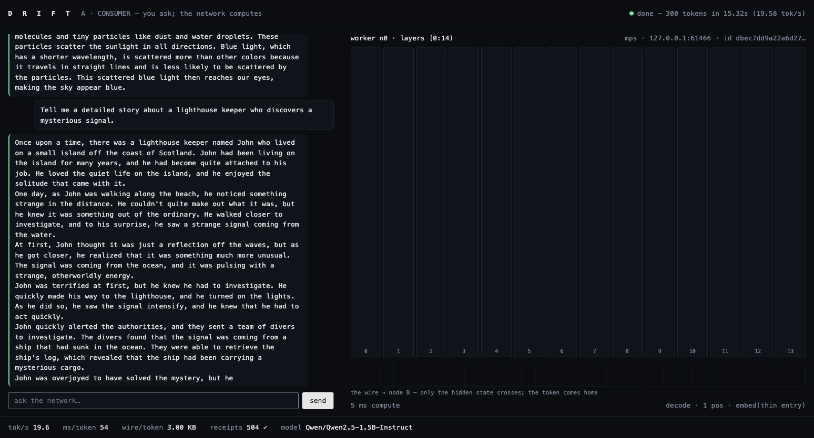
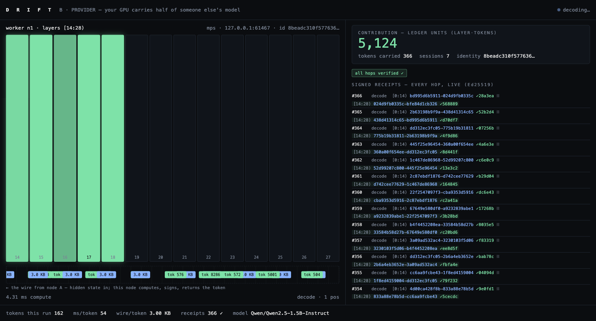

# DRIFT-Demo

**A two-screen visual demo of a [DRIFT](https://github.com/TaewoooPark/DRIFT) peer-to-peer inference run — the "For Tokens" economy, both faces at once.**

One model is split layer-by-layer across two DRIFT workers (peer-to-peer chain, weightless head), and each side of the exchange gets its own full-screen view:

| view | who | what the screen shows |
|---|---|---|
| **A · consumer** (`/a`) | the one asking | a chat box; the front half of the model (layers `[0:14)`) lighting up as it computes; the hidden state leaving over the wire, and the token coming home |
| **B · provider** (`/b`) | the one contributing | the back half (layers `[14:28)`) computing; every hop's **Ed25519-signed receipt** landing live; the contribution tally (**layer·tokens** — the ledger's settlement input) ticking up |

Staged on two laptops side by side (A left, B right), the consumer's packets exit toward the right edge and the provider's enter from the left — the wire appears to cross the bezel. In `--local` mode both views run on one machine in two browser windows.

**Every pixel is real.** The demo never edits the DRIFT sources and never simulates data: a stock DRIFT worker is instrumented at process start by monkey-patching three call sites (`TorchShardEngine.forward`, `Node.handle`, `Node._relay`), which emit fire-and-forget UDP events *out of band* — the parity-gated inference path is untouched. The receipt hashes on screen are the actual receipts the head verifies; the run journals them, so a demo run itself audits with `drift ledger`.

## What it looks like

| A · consumer | B · provider |
|---|---|
|  |  |

*(captured mid-generation on a live local run — the provider's layer wave, the receipt stream, and the 5,124 = 366 × 14 layer·token tally are real traffic)*

## Run it

Requires Python 3.12 and [`uv`](https://github.com/astral-sh/uv).

```bash
bash scripts/setup.sh          # vendors DRIFT into vendor/, builds .venv
.venv/bin/python -m demo       # spawns 2 local workers, opens /a and /b
```

Then type a prompt in view A. First launch loads the model shards (~10–60 s); the overlay lifts when the network is assembled.

```
http://127.0.0.1:8800/a   consumer
http://127.0.0.1:8800/b   provider
```

Options:

```
python -m demo --nodes 3            # more workers (view N: /b?node=2)
python -m demo --model <hf-id>      # any model DRIFT runs (default Qwen2.5-1.5B-Instruct)
python -m demo --max-new-tokens 400
python -m demo --no-browser --port 8800
```

## Audit a run

The head journals every verified receipt to `.state/journal-<ts>.jsonl`:

```bash
.venv/bin/drift ledger .state/journal-*.jsonl --verify
```

Two local workers sign with **distinct** Ed25519 identities (`.state/node{0,1}.identity`), so the tally shows two contributors even on one machine.

## How it fits together

```
demo/node_main.py     stock `drift node`, instrumented (no mDNS/gossip — local demo)
demo/instrument.py    the monkey-patches: compute timing, step arrival, p2p relay
demo/head.py          weightless (thin) head + step-wise decode loop, events per token
demo/events.py        fire-and-forget UDP JSON emitter (out-of-band, non-blocking)
demo/server.py        stdlib HTTP: /a /b, SSE /events, POST /api/generate, /api/state
demo/__main__.py      launcher: spawn workers → assemble chain+thin head → serve
demo/static/          the two views (plain HTML/CSS/JS, no build step)
```

Topology per generated token (chain + thin head, M7/M10):

```
head ──ids──▶ n0 [0:14) ──hidden 3.1 KB──▶ n1 [14:28) ──token──▶ head
              └─ signs receipt              └─ signs receipt      └─ verifies both, live
```

DRIFT itself is vendored read-only under `vendor/DRIFT` (gitignored; pinned by `scripts/setup.sh`).
